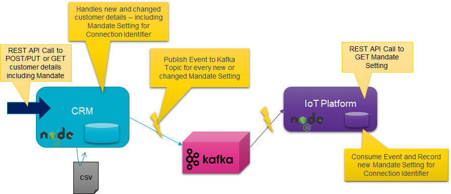
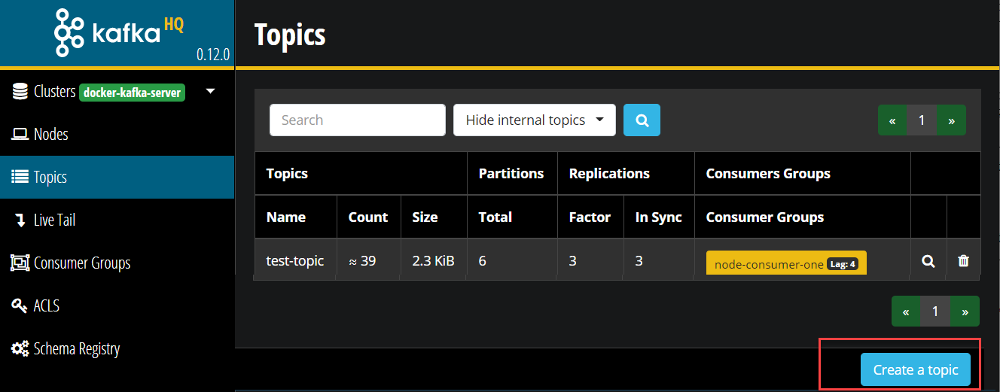
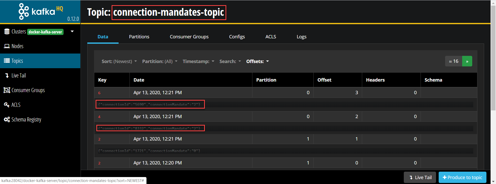

# Lab 3 - DIY CQRS using Apache Kafka
In the previous lab, you have created Kafka client applications in Node. The applications produced to Kafka Topics and consumed messages from Kafka Topics. 

In this lab, we are going one step further to implement a fairly realistic use case. The context is a utility company. It is starting out with Smart Meters in the field and an IoT Platform to collect readings from those meters. In order to be allowed to collect readings from a meter associated with a connection (gas, heat or electricity), a customer needs to provide a mandate to the utility company. Such a mandate either grants permission to read with high frequency (semi real time) or to read once a month, only for the purpose of calculating the bill. If no mandate is issued by the customer, then no readings can be collected from the meter.

The connection mandates - along with all other information regarding customers, such as their address and contact details are managed by the CRM microservice. This service manages the state of customer related data. It handles REST API calls that provide new customer related data and it responds to REST API calls requesting data on customers. Note: we will not discuss security and GDPR related details at this point.

Part of the data managed by the CRM service is needed by the IoT Platform service. We want microservices to be as independent as possible. We do not want to have the successful operation of either service depend on the current availability of the other service. We do not even want services to know about other services if they do not really have to.

It has been decided therefore by the architects in this utility company that a new domain event has been identified: the Connection Mandate event that has a simple payload with just two fields: the connection identifier and the mandate level (0, 1 or 2 for no mandate, billing only or real-time reading). The team that owns the CRM service is instructed to publish the Connection Mandate event to a Kafka Topic - whenever the mandate settings for a customer change. The IoT Platform team is likewise advised to consume events from the same Kafka Topic and use these events to construct an actual overview of the mandate settings for all connections (gas, electricity or heat) they want to collect smart meter readings from.



In this lab, you will implement and run both microservices and the Kafka Topic that provides the decoupled bridge between the two.

Note: the resources for this lab are in the lab3 folder in the [Git repo on GitHub](https://github.com/AMIS-Services/kafka-introduction-workshop). 

Steps
* CRM Microservice to handle REST calls with data read and manipulation requests; the CRM Microservice loads initial data from a CSV file and it currently does not write any changes in the state of its data
* Create Kafka Topic for Connection Mandate settings 
* Extend CRM Microservice with publication of Connection Mandate messages to Kafka Topic
* IoT Platform Microservice that handles REST GET requests for the Mandate setting for a specific connection - initially without any Mandate data
* Extend IoT Platform Microservice with consumption of Connection Mandate messages from the corresponding Kafka Topic and use them to build the actual state of Connection Mandates
* Experiment with stopping and starting the IoT Platform Microservice and its ability to retain or regain its state 


## CRM Microservice 
Focus on the directory *CRM* in the lab3 folder. Here is where the CRM Service sources are.

The main service is defined in *app.js*. It uses the core Node *http* module that we have seen before. Using this module, it starts an HTTP Server, listening at PORT 3005 for GET and POST requests to read customer records or write new or modified customer records.

The *customers* object in *app.js* is the store of customers - the simple in-memory alternative to a real data store (such as NoSQL database or relational database or even an in-memory cache). We use the customer identifier as the key for storing and locating customers in this object.

When *app.js* is started, it runs function *importCustomers* from the *importer* module (file *importer.js*). This function reads the csv-file *customer-database.csv*, a simple comma separated values file with imaginary customer records. Each record read by *importCustomers* from this file is turned into a JavaScript object; the names of the properties of this object are taken from the field names in the header record in the CSV file. In the call to *importCustomers*, function reference is passed to a function that can handle customer objects. Using the *forEach* operator on the *customers* array, this function is invoked for each customer record that is read from the file.

Function *processCustomer* is defined in *app.js* and is passed to the *importCustomers* function. It adds new customer records to the *customers* collection of customers. For new customer records without identifier, it generates a new customer id value - with one added to the highest current customer identifier.  

Function *handleGetCustomer* is invoked to handle GET requests for retrieving customer information. The function can handle a request with a query parameter *customerId* to retrieve details for a single customer. A GET request with no query parameters return a full list - in JSON format - of all customers managed by the CRM service.  

Install the dependencies for the CRM service and run the service from the command line in the *lab3-diy-cqrs\CRM* directory:
```
npm install
npm start
```
On the console, you should see log output indicating that the CSV file is read and processed.

### Make HTTP Calls to the CRM Microservice
Using a tool such as Postman or tools like cURL or wget you can try to get in touch with the CRM Microservice. For example to request details on a customer with identifier 42, make the following call:
``` 
curl  http://localhost:3005?customerId=42 -v
```
You should find the console logging of the CRM service that the request was received, and you should see a response from it whose details are written to the command line by cURL. Defining appropriate status codes and messages go a long way in making the use of APIs a more pleasant experience. Try leaving out the customerId parameter; this should return a list of all customers.

Now try making a request for customer identifier with which real customer data is associated:
``` 
curl  http://localhost:3005?customerId=2 -v
```
To create a new customer, use this call with cURL:
```
curl POST http://localhost:3005/customers -H "Content-Type: application/json" -d '{    "firstName": "Molly",    "lastName": "Peterson",    "city": "Zeewolde",    "connectionId": "928",   "connectionMandate": "0"}' -v
```
On Windows, use the next call (Windows deals differently with ' and ""):
```
curl POST http://localhost:3005/customers -H "Content-Type: application/json" -d "{    \"firstName\": \"Molly\",    \"lastName\": \"Peterson\",    \"city\": \"Zeewolde\",    \"connectionId\": \"928\",   \"connectionMandate\": \"0\"}" -v
```
A new customer is created and the response to this request should indicate the newly assigned customer identifier. Of course you can subsequently GET the details for this new customer, by using that identifier.

## Create Kafka Topic for Connection Mandate settings 

The CRM Service is running and it is handling new customers as well as changes to existing customers. The next step to take is to make the CRM service inform the enterprise (IT landscape) of these customer related events. And the first step in realizing this requirement is the creation of a Kafka Topic onto which these events can be published.

Like you did in Lab 1, open a terminal window on the Docker Host and run a `docker exec` command to start a shell in the `kafka-1` docker container 

```
docker exec -ti kafka-1 bash
```
Now let's create a new topic. For that we use the **kafka-topics** utility with the `--create` option. Create a *connection-mandates-topic* topic with 4 partitions and a replication factor of 2.  

```
kafka-topics --create \
			--if-not-exists \
			--zookeeper zookeeper-1:2181 \
			--topic connection-mandates-topic \
			--partitions 4 \
			--replication-factor 2
```
Run this command to list the topics.

```
kafka-topics --list --zookeeper zookeeper-1:2181
```
You should see the new topic you have just created. 

Note: you can also create a new topic on the *Topics* page in AKHQ



## Extend CRM Microservice with event publication to connection-mandates-topic

Add this next line at the top of *app.js*; this imports module producer, defined in file *produce.js*. This module provides the bridge to the Kafka Topic.
``` 
const producer = require('./produce')
```
Note that the contents of *produce.js* is exactly the same as when we used this file in *lab2*. The configuration of the Kafka Cluster (the brokers) and the name of the topic is still in file *config.js*. Please make sure that the values in this value are correct for your environment.

Now whenever the CRM service registers a completely new customer, it should publish a message to the new *connection-mandates-topic* . And when for and existing customer anything changes in the values of connectionId or connectionMandate, then too should a message be published to the topic. 

The function that process both new and changed customers is function *processCustomer* in *app.js*. It is from this function therefore that the function *producer.produceMessage* is to be invoked with a message payload that looks like this:
```
{ "connectionId":"4617", "connectionMandate" : "1" }
```
Add the following lines near the end of the function, just before the return statement:
```
    // check if the either the customer is new or the mandate settings has changed; in both cases: an event needs to be produced
    if (!oldCustomer || (oldCustomer.connectionId != customerObject.connectionId) || (oldCustomer.connectionMandate != customerObject.connectionMandate)) {
        producer.produceMessage(JSON.stringify({ "connectionId": customerObject.connectionId, "connectionMandate": customerObject.connectionMandate }))
    }
```
Run the application again. In the console output, there should be messages telling you about messages that are produced to the new Kafka Topic *connection-mandates-topic*.

When you register a new customer with the CRM service - a message will be published to the Kafka Topic as well. Try this out with this call with cURL:
```
curl POST http://localhost:3005/customers -H "Content-Type: application/json" -d '{    "firstName": "Molly",    "lastName": "Peterson",    "city": "Zeewolde",    "connectionId": "928",   "connectionMandate": "0"}' -v
```
On Windows, use the next call (Windows deals differently with ' and ""):
```
curl POST http://localhost:3005/customers -H "Content-Type: application/json" -d "{    \"firstName\": \"Molly\",    \"lastName\": \"Peterson\",    \"city\": \"Zeewolde\",    \"connectionId\": \"928\",   \"connectionMandate\": \"0\"}" -v
```
You can easily check the messages currently on the Kafka Topic in the Apache Kafka HQ GUI: http://kafka:28042/docker-kafka-server/topic/connection-mandates-topic .


## IoT Platform Microservice 
that handles REST GET requests for the Mandate setting for a specific connection - initially without any Mandate data


## Extend IoT Platform Microservice with consumption of Connection Mandate messages

 from the corresponding Kafka Topic and use them to build the actual state of Connection Mandates

## Experiment with stopping and starting the IoT Platform Microservice 

and its ability to retain or regain its state 