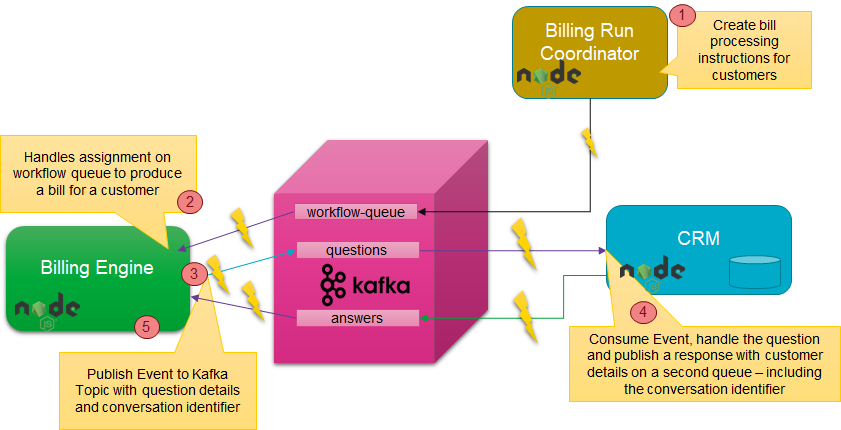

# Lab 4 - Microservice Interaction
Microservices should be as autonomous as they can be. Ideally, they make no calls to other microservices, especially not  synchronous ones. They can stand alone when it comes to the data they need to do their jobs. In the previous lab we have looked at CQRS and locally maintaining derived state based on events published by other microservices. The only dependency for this, is a dependency on the highly available, highly scalable, distributed Kafka Cluster - and on the common definition of the message published on the topic.

In this lab we will look at the situation where a microservice needs to leverage the functionality offered by another service. It should still be as autonomous as possible: it should not need to know where the other microservice lives, how it was implemented, if it is even running at present. An agreement has been made on asynchronous communication via Kafka Topics: send a request through one topic and receive a correlated response in another topic. Without direct dependency - design or run time - many instances of the microservices involved can collaborate in a highly scalable, highly available fashion. 

The steps for implementing this scenario:
* create three Kafka Topics: workflow-queue, questions-topic and answers-topic
* create Billing Run Coordinator - a REST API invoked with one or more customer identifiers to order a bill to be produced for each customer
* create Billing Engine - a microservice that consumes bill-generate instructions in the form of messages from the workflow-queue, requests some customer details from the CRM Service - albeit in a very decoupled manner - and generates a bill in the form of a local file
* extend the CRM Service with the a feature to listen to the questions-topic, process a request and produce an answer

## Create Three Kafka Topics

create three Kafka Topics: workflow-queue, questions-topic and answers-topic

## Billing Run Coordinator - Workflow Initiator

* create Billing Run Coordinator - a REST API invoked with one or more customer identifiers to order a bill to be produced for each customer

## Billing Engine Microservice - Workflow Step Execution Engine
* create Billing Engine - a microservice that consumes bill-generate instructions in the form of messages from the workflow-queue, requests some customer details from the CRM Service - albeit in a very decoupled manner - and generates a bill in the form of a local file

## CRM Microservice - Asynchronous Answering Machine
* extend the CRM Service with the a feature to listen to the questions-topic, process a request and produce an answer

## Trigger the Billing Run Workflow
Make a request to the Billing Run Coordinator for two customers. Watch as the bills for these two customers are produced through asynchronous collaboration between three services that are unaware of each other. They can scale, crash & recover, relocate, reimplement in new technologies without impacting each other. 