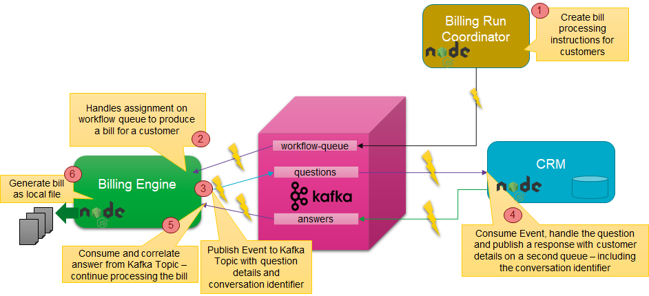

# Lab 4 - Microservice Interaction
Microservices should be as autonomous as they can be. Ideally, they make no calls to other microservices, especially not  synchronous ones. They can stand alone when it comes to the data they need to do their jobs. In the previous lab we have looked at CQRS and locally maintaining derived state based on events published by other microservices. The only dependency for this, is a dependency on the highly available, highly scalable, distributed Kafka Cluster - and on the common definition of the message published on the topic.

In this lab we will look at the situation where a microservice needs to leverage the functionality offered by another service. It should still be as autonomous as possible: it should not need to know where the other microservice lives, how it was implemented, if it is even running at present. An agreement has been made on asynchronous communication via Kafka Topics: send a request through one topic and receive a correlated response in another topic. Without direct dependency - design or run time - many instances of the microservices involved can collaborate in a highly scalable, highly available fashion. 



The steps for implementing this scenario:
* create three Kafka Topics: workflow-queue, questions-topic and answers-topic
* create Billing Run Coordinator - a REST API invoked with one or more customer identifiers to order a bill to be produced for each customer
* create Billing Engine - a microservice that consumes bill-generate instructions in the form of messages from the workflow-queue, requests some customer details from the CRM Service - albeit in a very decoupled manner - and generates a bill in the form of a local file
* extend the CRM Service with the a feature to listen to the questions-topic, process a request and produce an answer

## Create Three Kafka Topics

create three Kafka Topics: workflow-queue, questions-topic and answers-topic

Like you did in Labs 1 and 3, open a terminal window on the Docker Host and run a `docker exec` command to start a shell in the `kafka-1` docker container (or use Apache Kafka HQ to create the topics from the GUI)

```
docker exec -ti kafka-1 bash
```
Use the **kafka-topics** utility with the `--create` option to create the three topics: *workflow-queue*, *questions-topic* and *answers-topic*. Create the topics with a fairly arbitrary configuration with 4 partitions and a replication factor of 2.  

```
kafka-topics --create \
			--if-not-exists \
			--zookeeper zookeeper-1:2181 \
			--topic workflow-queue \
			--partitions 4 \
			--replication-factor 2
kafka-topics --create \
			--if-not-exists \
			--zookeeper zookeeper-1:2181 \
			--topic questions-topic \
			--partitions 4 \
			--replication-factor 2            
kafka-topics --create \
			--if-not-exists \
			--zookeeper zookeeper-1:2181 \
			--topic answers-topic \
			--partitions 4 \
			--replication-factor 2            
```
Run this command to list the topics.

```
kafka-topics --list --zookeeper zookeeper-1:2181
```
You should see the new topics you have just created. 


## Billing Run Coordinator - Workflow Initiator
The Billing Run Coordinator is a simple Node application that exposes a REST API that can be invoked with one or more customer identifiers to order a bill to be produced for each customer. The application will not produce a bill itself. Instead, it will publish a message on the *workflow-queue* topic with an instruction to generate a bill for a specific customer. This message has the following simple payload:
```
{ "workflow-type": "bill-generation"
, "workflow-id" : "71638"
, "create-time" : "2020-04-15T14:24:11Z"
, "payload": { "customerIdentifier": "321"} 
}
```
The `workflow-type` specifies the type of workflow to be executed. The payload element contains whatever payload is relevant for the type of workflow. In this case, it contains the customer identifier.

Check out the file *app.js* in directory *lab4-microservice-interaction\billing-run-coordinator*. The code should look somewhat familiar by now:
* HTTP Server listening at port 3007
* POST request handler
* the body of the request is JSON parsed into a Javascript object (an array with customer identifier values)
* an imported *produce* module that connects to a Kafka Cluster and a KAFKA Topic defined in *configure,.js*  (*workflow-queue*)
* for each customer identifier, the *produceMessage* function is invoked with a workflow message to be produced to the *workflow-queue* topic

Before you can run the application, you need to install the npm dependencies, then start the npm application:
```
npm install

npm start 
```
You can now invoke the Billing Run Coordinator service - from Postman or using cURL from the command line. The following request instructs the Billing Run Coordinator to have bills generated for three customers:
```
curl POST http://localhost:3007 -H "Content-Type: application/json" -d '{"customerIdentifers":["2","4","5"]}' -v
```
On Windows, use the next call (Windows deals differently with ' and ""):

```
curl POST http://localhost:3007 -H "Content-Type: application/json" -d "{\"customerIdentifiers\": [\"2\",\"4\",\"5\"]}" -v
```
At this point, no bill is generated yet. No bill is in the process of being generated. The generator is not even available. But the instruction to prepare the bill have been safely persisted on the *workflow-queue*.

## Billing Engine Microservice - Workflow Step Execution Engine
The Billing Engine microservice will do the work of generating bills. It consumes bill-generation instructions in the form of messages from the workflow-queue, requests some customer details from the CRM Service - albeit in a very decoupled manner - and generates a bill in a local file.

There are some things diffent about this microservice. For starters, it does not expose REST API. The only interactions this service has are through Kafka Topics (consuming from two of them, producing to one topic) and the file system (generating bills to the local file system).

Before you can run the application, you need to install the npm dependencies, then start the npm application:
```
npm install

npm start 
```

## CRM Microservice - Asynchronous Answering Machine
* extend the CRM Service with the a feature to listen to the questions-topic, process a request and produce an answer

## Trigger the Billing Run Workflow
Make a request to the Billing Run Coordinator for two customers. Watch as the bills for these two customers are produced through asynchronous collaboration between three services that are unaware of each other. They can scale, crash & recover, relocate, reimplement in new technologies without impacting each other. 